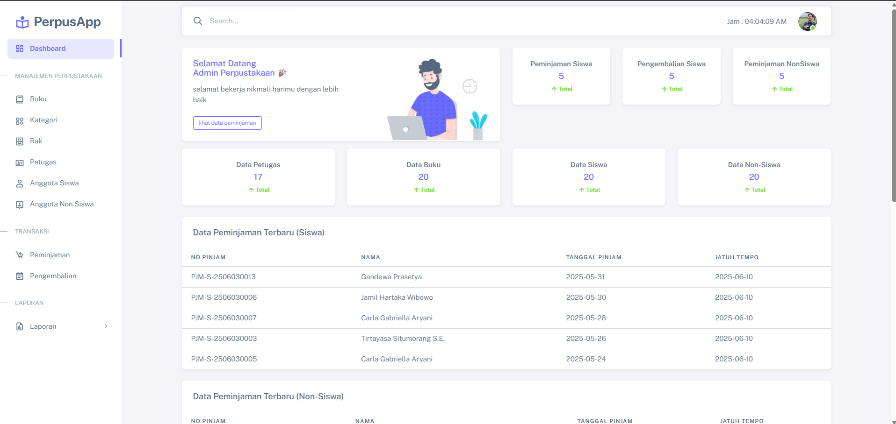

# 📚 PerpusApp - Aplikasi Manajemen Perpustakaan

## Tentang PerpusApp

PerpusApp adalah sebuah aplikasi manajemen perpustakaan digital yang dirancang untuk memudahkan pengelolaan data buku, anggota, peminjaman, pengembalian, dan denda secara efisien. Dengan antarmuka yang sederhana namun modern, PerpusApp mempermudah petugas perpustakaan dalam melakukan proses administrasi, serta memberikan kemudahan akses informasi kepada anggota perpustakaan. Aplikasi ini dikembangkan menggunakan teknologi web dan mendukung fitur multi-role untuk admin dan anggota, serta dilengkapi dengan statistik penggunaan dan laporan yang dapat diakses secara real-time.

## ✨ Fitur Utama

- 🔐 Sistem login multi-level (Admin & Petugas)
- 📚 Manajemen data buku (Tampil, Tambah, Ubah, Hapus)
- 👥 Manajemen petugas dan anggota perpustakaan
- 🔄 Proses peminjaman dan pengembalian buku
- 💰 Perhitungan denda keterlambatan otomatis
- 📊 Statistik peminjaman dan aktivitas perpustakaan
- 🧾 Pembuatan laporan buku, anggota, dan transaksi
- 📱 Tampilan responsif Desktop dan Mobile

## 🛠️ Teknologi yang Digunakan

- **Framework Backend:** Laravel 12
- **Frontend:** HTML, CSS, JavaScript, Blade, PHP, (Boxicons, Sneat, Bootsrap)
- **Database:** MySQL
- **Style & UI:** Sneat dan Bootsrap

## ⚙️ Cara Instalasi

1. **Clone repositori ini:**
- git clone https://github.com/Hazelnut-dev/PerpuApp-Laravel12.git

2. Masuk ke direktori proyek:
- **cd perpusapp**

3. Install dependensi Laravel:
- **composer install**

4. Salin file konfigurasi .env:
- **cp .env.example .env**

5. Sesuaikan pengaturan database di file .env sesuai database lokal Anda.

6. Generate key aplikasi:
- **php artisan key:generate**

7. Jalankan migrasi database:
- **php artisan migrate**

8.  Jalankan seeder untuk membuat data awal:
- **php artisan db:seed**

9. Jalankan server lokal Laravel:
- **php artisan serve**

10. Buka aplikasi di browser melalui:
- **http://localhost:8000**

## 🔐 Data Login Default

| Role   | Username           | Password  |
|:-------|:------------------:|----------:|
| Admin  | Admin              | admin     |
| Petugas| Petugas            | petugas   |

## 🤝 Kontribusi
Kontribusi sangat terbuka untuk siapa saja!
Silakan buat issue jika menemukan bug atau ingin menambahkan fitur.
Pull Request (PR) akan sangat dihargai.

## 📄 Lisensi
Proyek ini menggunakan lisensi MIT License, yang berarti bebas digunakan, dimodifikasi, dan disebarkan untuk tujuan pribadi maupun komersial.

## 📬 Kontak & Dukungan
Jika Anda memiliki pertanyaan atau ingin bekerja sama dalam pengembangan aplikasi ini, silakan hubungi:

Email: AkbarDirgantara762@gmail.com

GitHub: https://github.com/Hazelnut-dev?tab=repositories